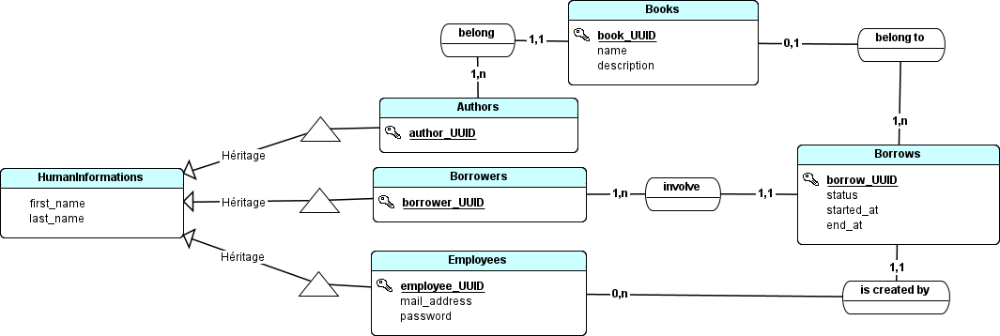

  

# API interne pour une Médiathéque

Ceci est une API créée pour les employés d'une médiathèque, depuis NestJS.

Docs NestJS  [link to docs NestJS](docs/readmeNest.md) .

 [Spécifications fonctionnelles](docs/Spec.md) .

### Merise

#### MCD

#### MLD

